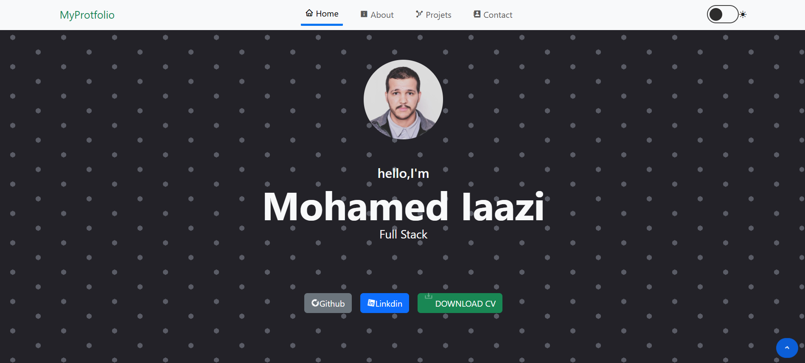
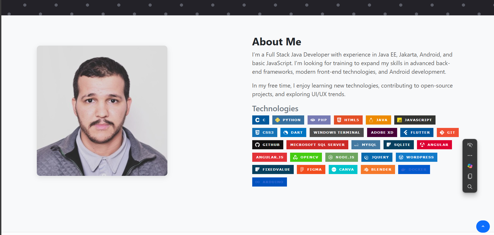
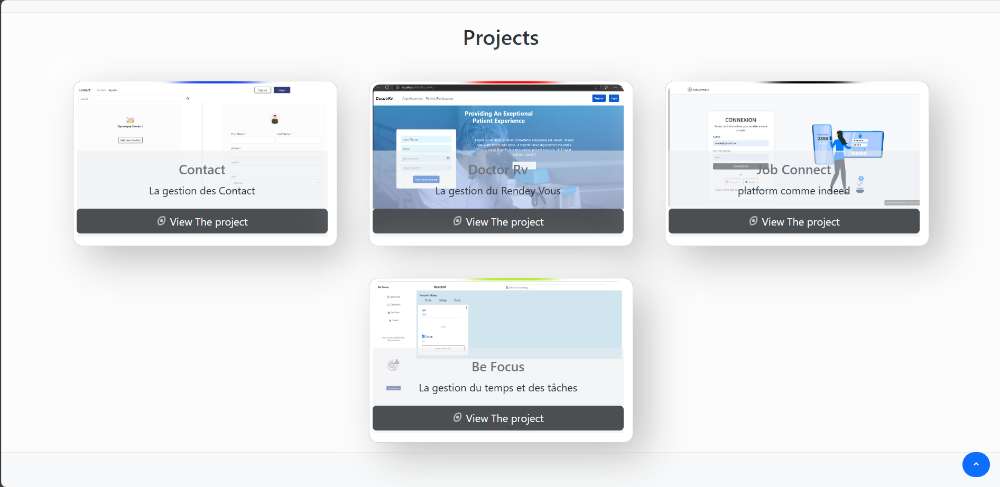
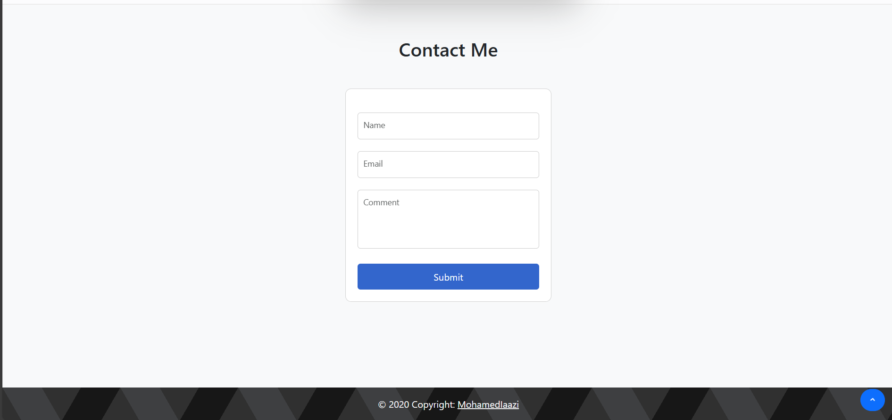

# 💼 MyPortfolio

Bienvenue sur **MyPortfolio**, un site web professionnel réalisé avec **Angular 19**, conçu pour présenter mon parcours, mes compétences et mes projets. Ce portfolio permet aux visiteurs de découvrir mon univers tech, d'explorer mes réalisations, et de me contacter facilement.

## ✨ Fonctionnalités principales

- **Page d'accueil** claire et professionnelle
- **Présentation personnelle** : bio, photo, rôle
- **Section "À propos"** : parcours, compétences, outils utilisés
- **Liste de projets** : cartes interactives avec image, titre, description, lien GitHub/démo
- **Filtrage de projets par technologie**
- **Formulaire de contact** fonctionnel avec validation des champs
- **Téléchargement du CV** au format PDF
- **Navigation fluide** via une navbar avec ancres (Accueil, À propos, Projets, Contact, CV)
- **Footer** avec raccourcis et copyright
- **Bonus** :
  - Mode sombre / clair 🌙☀️
  - Site **multilingue** : 🇫🇷 / 🇬🇧

---

## 🖼️ Aperçu
-Home


-About


-projects


-Contact


## 🧱 Architecture du projet

### 📁 Composants Angular

- `home` : Page d'accueil
- `about` : Section à propos
- `project` : Affichage des projets + filtrage
- `cv` : Téléchargement du CV
- `contact` : Formulaire de contact
- `navbar` : Barre de navigation
- `footer` : Pied de page

### 🛠️ Services

- `ProjectService` : Gestion des données des projets

### 🧭 Modules

- `AppRoutingModule` : Gestion des routes du site

---

## 🧰 Technologies utilisées

- **Framework** : Angular 19
- **Langage** : TypeScript, HTML, CSS
- **UI Framework** :  Bootstrap
- **Hébergement** : GitHub Pages

---

## 🚀 Lancer le projet en local

1. **Cloner le dépôt** :
   ```bash
   git clone hhttps://github.com/mohamed-iaazi/MyPortfolio.git
   cd MyPortfolio
